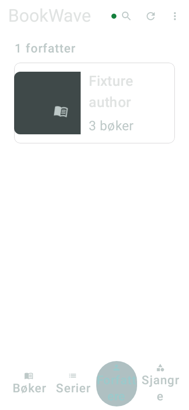

# Browse selection and counts — 2026-10-04

**Classification:** Dated draft-candidate evidence; results apply only to the recorded source/APK.
Imported during the 2026-10-04 reconciliation. The associated runtime PR remains unmerged;
[the roadmap](../roadmap.md) owns current delivery status.

Requirements: LIB-001/002, AUTH-002, PRODUCT_SPEC 17.2/21; PD-006/007; GitHub #227/#228.
Implementation is on `fix/browse-selection-counts`, stacked on planning PR #226. This report records
the bounded navigation/count slices; author details #229 remain queued after performance/download work.
Garmin remains parked; neither watch research nor other platforms start here.

## Reproduction and source evidence

A stable Home actions callback reproduced the reported mismatch through the actual HomeScreen pager:
Books → Series → Books ended with axis Series, and Authors → Genres → Authors ended with axis Genres.
The listener filtered settled pages against the initial captured axis. Reading the latest axis/callback
with rememberUpdatedState fixes that comparison without replaying a settled page during a tab animation.
The original continuous pill position, settled-page policy and pager/ViewModel ownership remain.

The rendered count regression failed because the Series header said `2 books` rather than `2 series`.
Counts now derive distinct book/series/group identities from the displayed authorized Room-backed rows.
Books shelf previews retain their uncapped source total. Partial refresh and offline captions keep their
caveats while naming the displayed entity; loading, failure and never-synced status remain distinct.
There is no API/endpoint, schema, profile, progress or playback policy change.

Production caller audit: HomeRoute binds HomeViewModel::onAxisChanged into HomeScreen → rememberAxisPager;
ShelfHeader → syncStatusLabel/entityCountLabel → visibleEntityCount reaches the new count projection.
Existing HomeViewModel axisRows preserves current and preview ownership and loaded-versus-empty state.

## Automated verification

- Pre-fix `browse-red-confirmed.log`: four selected tests, three failures (both return gestures plus entity
  labels); the cancelled drag passes. These are actual caller-path failures, not isolated helper tests.
- First fixed run: 33 HomeScreen/gesture/selection tests pass.
- Added count coverage: distinct identities/zero values, focused book results/profile replacement,
  partial/offline/loading states and Norwegian singular/plural/partial text pass.
- Native normal/200% text fixture renders pass. Final `ktlintFormat` and
  `verifyDebug -Pshelfplayer.warningsAsErrors=true` pass (4m32s; 1,122 tasks), including all 39 targeted
  HomeScreen/gesture/selection/count/native-render cases. No classpath change requires a forced rerun.
- The initial full gate caught obsolete `home_offline_caption` as an unused resource. Reusing that resource
  for the counted offline caption removed the error; the failed log remains evidence.
- Physical `:core:datastore:connectedDebugAndroidTest`: **27 tests passed, zero failures/errors/skips**
  on Samsung SM-S928B, Android 16 / API 36. The ignored init script uses the same disposable test-package
  override as the prior phone acceptance; it does not replace the owner's application or its data.
  Environment checker passes; Docker remains optional/absent because no endpoint fixture changes here.

Fixture-only native render evidence:

The fixture's three books count as one author. These are native Robolectric renders, not physical phone
or actual TalkBack evidence. The native snapshot's glass/backdrop appearance is not a real-theme contrast
acceptance claim. Private phone images/XML/database snapshots remain under ignored build evidence.

## Physical browse acceptance

The phone was connected/unlocked and started on signed debug 0.10.6.1 / code 2179. Production playback was
paused. A private pre-upgrade Room snapshot passed quick_check: 2 profiles, 522 cached books, 55 progress
rows, 124 history rows and 2 downloaded books. Only aggregate observations/hashes are shared.
The initial UI dump could time out during animation; failed dumps and earlier cached XML are not accepted
as fresh evidence. A temporary capture class injected through an ignored init script into the existing
self-instrumented UIAutomator2 harness produced fresh hierarchy files with decorative-animation idle
waiting disabled. It adds no tracked source/dependency and does not instrument the owner's app process.
The legacy framework runner attempt failed on API 36 and supplied no accepted evidence. The signed fixed-APK delivery and its accepted subcases are recorded below.

| Case | Current evidence / remaining obligation | Status |
| --- | --- | --- |
| U-06-01 | Both caller regressions fail before/pass after. 14:50:35–39 UTC, signed 2181: Books → Series → Books content/pill/highlight agree; fresh XML marks exactly one tab and screenshots confirm its pill/color. | PASS for this phone round trip and automated guards |
| U-06-02 | 14:53:20–44: all four axes forward/back plus Books-right/Genres-left overspill; exactly one checked tab and matching caption at nine checkpoints. | PASS on tested phone/configuration |
| U-06-03 | 15:16:08–15 UTC retry: cancelled short drag, rapid swipe/return, swipe then immediate Books tap and rapid Series → Authors → Books taps all settle on Books with the correct checked destination. The earlier 15:08 interruption by ChatGPT remains non-acceptance evidence. | PASS for these controlled gesture/tap sequences |
| U-06-04 | Non-default Authors survives 200% text and orientation changes. At 15:16:18–22, Series detail opens and system Back returns to the correctly selected Series axis. Separate Book/Author Back and process-death restoration remain pending. | Tested configuration/Series Back portions PASS; remaining route/restoration matrix NOT RUN |
| U-06-05 | Exactly one checked destination at each physical walk checkpoint; Compose selected/offscreen semantics pass. Actual TalkBack focus/announcements were not assessed. | Semantics PASS; actual TalkBack NOT RUN |
| U-06-06 | 15:04:06–38 display/offline checks pass. At 15:22:20–35, the same BookWave media-session metadata hash remains PLAYING across all four axes and position advances; playback is PAUSED at 15:22:36. This checks state continuity, not heard-route quality or every appearance combination. | Tested display/offline/media-state portions PASS; full-theme/heard-route portions NOT RUN |
| U-07-01 | Phone shows 222 books / 48 series / 41 authors / 44 genres. Those exact values match one authorized library/profile scope in the private pre-upgrade Room snapshot; identities/zero/one/many/coauthor-like shared rows and uncapped shelf counts are guarded automatically. | Automated PASS; populated phone-scope counts PASS |
| U-07-02 | Norwegian phone captions/offline caveats pass; English/Norwegian plurals and focused books pass automatically. The Android locale-command attempt did not change the app interface, so English physical acceptance must use the app-owned language setting. Original follow-system locale restored. | Partial PASS; live English/search/filter/spoken portions NOT RUN |
| U-07-03 | Displayed counts match an authorized cached scope, and profile-row replacement is guarded automatically. In-place upgrade preserves both profiles. Live profile/library/revocation matrix was not run. | Partial PASS; live authorization matrix NOT RUN |
| U-07-04 | Partial/offline/loading and original failed/never-synced rendered guards pass. Offline phone captions are truthful with cached counts; failed/partial-sync injection remains untested. | Automated/offline subcases PASS; live injection NOT RUN |
| U-07-05 | All-axis gestures and cached-scope counts pass; large text/orientation, reduced motion and offline captions pass. Active media state remains PLAYING during all four axis taps, with the same media identity and advancing position. Live updates and spoken labels remain pending. | Tested browse/display/offline/media-state portions PASS; remaining live/spoken portions NOT RUN |

U-08 author-detail cases remain NOT RUN awaiting #229; broad release/download/performance/host acceptance
is not inferred from this browse slice. Each later phone result must identify its actual source/APK,
UTC/configuration/expected/observed evidence, and preserve the above pending portions.

## Signed delivery and retained data

Debug 0.10.6.1 / code 2181, package `org.homebord.bookwave.debug`,
source `00ee58c6d58cf38213b4a03c5e6ba9bfe866101c`; trusted [APK run 37210268290](https://github.com/AlexanderWilhelmsenBerg/Audiobookshelf-Manager-Claude/actions/runs/37210268290),
artifact 11306297019. Archive digest matched; APK SHA-256 `2c3b7af80a2d43b8ba7871aba9179b1cff35e43604a71313cb4f9f63df503959`;
certificate SHA-256 `c63c72cb2c4b32a8ed3775e4cc0b5754abf06b5beb4481ea5a8f5c5c0dd9217c`; Loopbound `7e24529b2a9e419218d2a1423d832b1bf587c8ef` verified.
The APK embeds its expected source prefix. [CI 37210268851](https://github.com/AlexanderWilhelmsenBerg/Audiobookshelf-Manager-Claude/actions/runs/37210268851)
passed the same source. Later report-only commits do not imply this phone tested a different binary.

14:47:48 UTC: 2179 → 2181 in-place installation succeeded with the shared signing identity.
Before first launch, quick_check was `ok`, all eight aggregate table counts were unchanged, and all 55
progress rows retained the same profile/book/position/duration/finished hash
`014faa2f94c342573a78b508183aeacd981dad6ac1331a222c75f7d500be9d22`. Both profiles, two downloaded books and 124 history rows remained.
This is an upgrade/data check; About UI identity and broad Q-01/playback acceptance are separate obligations.

Physical environment: Samsung SM-S928B / Android 16 / API 36; 1080×2340, 450 dpi, Norwegian/dark; user 0 only.
Display checks temporarily used font 2.0, fixed landscape, animator scale 0 and disabled Wi-Fi/mobile data.
All original settings were restored and read back: font 1.0, accelerometer rotation 1, user rotation 0,
animator 1.0, Wi-Fi/data 1. Original app locale list remained empty (follow system).
Private captures are local ignored evidence; fixture renders above are the shareable UI artifacts.

The first rapid sequence was interrupted by a different foreground app. After the owner made the phone
available, the fresh 15:16 retry passed the controlled cancelled/rapid/mixed-intent and Series Back checks.
The locale-command attempt supplied no English acceptance: the interface remained Norwegian, consistent
with AppLocale applying the app-owned language preference. Use Settings → Appearance → Language for a
future physical English test; source/native localization guards already pass.

15:22:20–36 UTC: resumed the existing Continue book and traversed Series → Authors → Genres → Books.
The same media metadata hash stayed PLAYING; reported position advanced from 68,505,832 to 68,520,705 ms.
The test intentionally advanced the owner's progress by approximately 15 seconds; no seek rollback was
performed. Final pause is confirmed at 68,521,233 ms. State continuity is evidence for this navigation
sequence, not an acoustic/headset/network-continuity or two-hour acceptance claim.

Original display/network/locale settings were read back again after this retry. The disposable
`com.example.shelfplayer.benchmark.browsecapture` helper was uninstalled and its device temporary files
removed. BookWave remains installed and paused. No complete TalkBack, profile/permission, theme,
process-death restoration or broad release acceptance is claimed; pending portions remain open.

## 2026-10-05 acceptance correction

The later API36 phone run reproduces a 100ms fling followed immediately by a newer Books tap
overwritten by Series on APK2189 and APK2191. Prior PASS rows retain their narrower recorded scope.
The new four-case rendered selection guard passes; actual HomeScreen source reversion fails only
the unfinished-fling test, and restoring the correction passes strict verifyDebug. Corrected signed
phone acceptance is pending. See the [current merge test plan](2026-10-05-pr-merge-test-plan.md)
for selected later results and every remaining physical requirement.
