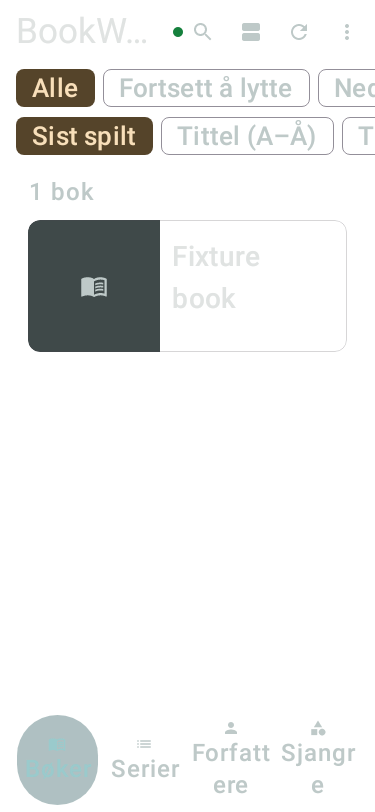

# Card blur sampling candidate — 2026-10-04

> **Historical source-scoped evidence.** Reconciled 2026-10-07: the relevant runtime PR is now merged. Original failures, draft build identities and NOT RUN statements below describe their recorded sources/dates. Later scoped results and current obligations are in the [verification register](roadmap-verification-register.md), [merge record](2026-10-05-merge-delivery.md) and [cross-repository audit](../reviews/2026-10-07-cross-repo-reconciliation.md).

**Classification:** Dated draft-candidate evidence; results apply only to the recorded source/APK.
Imported during the 2026-10-04 reconciliation. The associated runtime PR remains unmerged;
[the roadmap](../roadmap.md) owns current delivery status.

UI & Experience implementation lane; LIB-002, SET-002, PRODUCT_SPEC 17.3/21, ADR-0025/0026, R-25/R-27.
[Draft PR #231](https://github.com/AlexanderWilhelmsenBerg/Audiobookshelf-Manager-Claude/pull/231), stacked on browse PR #230; control source `69d0a3ca` (runtime `00ee58c6`). Phone tests are deferred
until the owner reconnects it after software work. Every device case below is NOT RUN.

## Evidence and candidate boundary

Analyze the saved synthetic 2,000-book scroll traces with official Perfetto v58.2. The shareable SQL
at [scroll-trace-cost.sql](https://github.com/AlexanderWilhelmsenBerg/Audiobookshelf-Manager-Claude/blob/a807021db0e2cae903f60b9da5fa84f000eb7cb2/scripts/performance/scroll-trace-cost.sql) emits only numeric totals
and fixed technical categories for BookWave's main/RenderThread. Inclusive categories overlap and
must not be added together or read as CPU-running time. Traces include idle/animation frames as well
as the flings, so attribution identifies an experiment; it does not establish a causal blur bottleneck.
The original benchmark metrics remain the frame-budget authority: CPU P95 19.145 ms, overrun P95
8.142 ms. The generated app profile remains outside production; library profiles remain unchanged.

Candidate: let the existing general BookCard's backdrop blur use HazeInputScale.Auto, leaving text,
cover artwork, layout, borders, tints, blur-radius preference and system chrome at their existing
resolution/behavior. Default sampling stays unchanged for every other GlassCard caller. No paging,
cache-size, dependency, schema, API, permission or playback-owner change.

Pinned [Haze 1.6.10 scope/default](https://github.com/chrisbanes/haze/blob/1.6.10/haze/src/commonMain/kotlin/dev/chrisbanes/haze/HazeChild.kt)
uses None by default. Its [scale calculation](https://github.com/chrisbanes/haze/blob/1.6.10/haze/src/commonMain/kotlin/dev/chrisbanes/haze/HazeEffectNode.kt)
keeps full input resolution below 7 dp, halves masked/progressive inputs, otherwise uses 0.3334 for
Auto. That is a potential quality tradeoff, especially at the 7 dp boundary. The candidate stays draft
until controlled phone timing and visual review justify keeping it; no speedup or target acceptance
is claimed from software tests or upstream measurements.

## Original control trace attribution

All ten saved scroll traces parsed successfully; [numeric/hash evidence](evidence/scroll-trace-cost-control.json)
uses source `1e74bab2`, SM-S928B/API 36 and the coverless 2,000-book fixture. Each reported one
`power_rail_empty_packet` import warning; no power/energy conclusion is drawn from these traces.

| Category | Median per-iteration count | Median inclusive duration |
| --- | --- | --- |
| Main frame | 580.5 | 1,315.679 ms |
| Main View draw recording | 574 | 556.991 ms |
| Compose recomposition | 128 | 48.582 ms |
| Haze effect lookup | 1,289.5 | 25.206 ms |
| RenderThread frame | 574 | 7,044.130 ms |
| RenderThread command flush | 574 | 3,309.875 ms |
| RenderThread layer flush | 565.5 | 1,535.385 ms |
| RenderThread text operations | 14,200 | 102.143 ms |

These are overlapping elapsed trace slices, not additive CPU costs. They justify probing backdrop
rendering before a paging/recomposition rewrite; they do not isolate blur from every GPU operation.
The query excludes personal slice strings and other processes. Official [Perfetto CLI documentation](https://perfetto.dev/docs/getting-started/command-line-analysis)
describes the local query form: `trace_processor query -f scripts/performance/scroll-trace-cost.sql TRACE`.
The analysis ran with v58.2, not the app's Android benchmark processor version.

Production caller audit: HomeScreen.AxisContent and the existing AuthorScreen both invoke BookCard;
BookCard → GlassCard(scaleBlurInput=true) → cardGlass → frostedGlass → hazeEffect scope applies Auto.
Other GlassCard/cardGlass/systemGlass callers omit the option, preserving HazeInputScale.Default.
The null-source fallback branch does not use sampling. A scoped ExperimentalHazeApi opt-in is needed
only in frostedGlass for the already-pinned library; this adds no dependency or classpath change.

## Test log and required acceptance

| Case | Required test / evidence | Current result |
| --- | --- | --- |
| PERF-01 | Analyze all ten existing library-profile control scroll traces; preserve source, tool/version, trace hashes and aggregate category numbers. | PASS — all ten original control traces analyzed; candidate timing NOT RUN. |
| PERF-02 | Audit actual Home/focused-list BookCard → GlassCard → cardGlass → frostedGlass effect callback; every other caller retains default sampling. | PASS — both Home/focused Books and existing Author list reach BookCard; only BookCard opts in. Other cards/chrome default to existing sampling. |
| PERF-03 | Normal/200% native fixture render and real Home row details click, title/progress semantics, cover fallback and selection/count regression suites. Hardware blur is not reproduced by Robolectric. | PASS for 11 focused software cases: two native flat-row details/selection/count guards, three settled-selection regressions, four count cases and two glass content-color cases. Physical blur/progress visibility remains pending. |
| PERF-04 | ktlintFormat and full verifyDebug with warnings-as-errors; benchmark/release-like assembly. Record failures and reruns; no changed classpath permits cache reuse. | PASS — ktlintFormat/full strict verifyDebug in 4m43s, 1,122 tasks (378 executed, 392 cached, 352 up-to-date). Candidate/harness packaging passed in 2m18s and control in 1m46s; explicit-identity rebuilds below also pass. |
| PERF-05 | Same phone/API/display/thermal/power, synthetic fixture, no app-owned profile, compilation mode, scroll journey and ten iterations. Build exact control/candidate APKs; run alternating control/candidate rounds and compare CPU P50/P95/P99 plus actual overrun percentiles/distributions separately. | NOT RUN — phone required; performance benefit/16.7 ms budget unaccepted. |
| PERF-06 | Physical cards at blur 0, below/at 7 dp, default 28 dp and maximum, card tint on/off, gradient/artwork/light/dark/AMOLED, moving/parallax background and rounded borders. Compare control/candidate screenshots for artifacts, grain, edges and lost contrast. | NOT RUN — phone required; visual-quality acceptance pending. |
| PERF-07 | Physical flat/focused rows, missing/cached/offline covers, scrolling with active player, all axes/rapid gestures, selection/counts, details/Back and local progress; same book continues without unintended Play/queue changes. | NOT RUN — phone required; existing PR #230 results do not accept this candidate. |
| PERF-08 | Physical English/Norwegian, 200% text, orientation, reduced motion and actual TalkBack; targets/labels/order remain usable. Retain known fixed-row clipping/theme obligations in the UI register. | NOT RUN — phone required; semantic/source tests alone are insufficient. |
| PERF-09 | API 26–30 no-blur fallback and API 31+ actual blur, low-memory device if available; startup/memory benchmark controls to detect displaced work. Covers-present workload remains separate from the coverless synthetic floor. | NOT RUN — device/configuration comparisons required. |
| PERF-10 | Recheck trusted signing/source/version and in-place data retention before candidate phone delivery; prepare exact APK and benchmark artifacts. Connected datastore/security tier after reconnect. | Trusted artifact/source/signer checks PASS for debug 2182 and both benchmark APKs; installation/About/data retention and connected tier NOT RUN — phone required. |

Q-05 cached-audio five-start latency and concurrent download/playback ANR stress remain separately
NOT RUN, along with broader download, host, sensor, account and accessibility matrices. This slice
does not advance author details, iOS, Silo or Garmin. Phone measurements must identify exact APK/source,
UTC/device/settings, expected/observed results and local evidence; do not transfer old binary results.

## Software evidence and its limits

Focused formatter + four test classes passed in 2m15s (353 tasks; 104 executed, 249 cached),
11 tests with zero failures/errors/skips. These are compatibility guards, not measurements of blur
cost: the new row tests exercise details-without-Play, title visibility, count and selected semantics.
They are not claimed to fail when sampling is disabled, because a correct compatibility guard should
pass for both control and candidate. Actual sampling reachability is audited above; its benefit is
PERF-05's physical obligation. Full strict verification and benchmark assembly results are recorded below.

The native fallback captures do not reproduce physical Haze/contrast. The large-text image confirms
the existing fixed 132 dp general-row limitation: title remains visible but the duration/progress
line is clipped. This candidate changes only the backdrop input and does not accept/fix that layout;
retain #192/#194 and the UI register's adaptive-row obligation, and check it physically in PERF-08.
No native screenshot is labelled a hardware blur/appearance PASS.

An initial local command lacked its ignored log directory and did not launch Gradle. A subsequent
tooling-cache startup was interrupted before tests; both are non-acceptance attempts. The accepted
focused run above used the populated local Gradle cache. No phone settings/data were touched this round.

Full `ktlintFormat verifyDebug -Pshelfplayer.warningsAsErrors=true`: PASS in 4m43s, including release/benchmark Kotlin compilation, lint/detekt, tests and both coverage gates. All 41 targeted Home/gesture/count/native row cases plus two glass-color cases pass. No dependency/classpath change requires a forced rerun. Benchmark packaging passed; physical acceptance remains separate.

## Exact artifacts prepared for the next phone session

Runtime candidate source `a70bfdf7e7690270c03ef553f722a2ec4c56eeb6`; control source
`69d0a3cad45ed75e200e488c344cf0a82ff5524d`. Later report-only commits are not different tested
binaries. Both prebuilt benchmark targets use `org.homebord.bookwave`, version code 2000, the same
local signer, non-debuggable/profileable manifest, compiled library .prof/.profm and no app-owned
MainActivity profile rule. The generated experiment profile remains outside the consumer.

Initial benchmark packaging succeeded but the identity verifier rejected both artifacts' default
`unknown`/`local` labels. Those bytes were not accepted for measurement. Rebuilding with explicit
bookwave.commit/branch/pr/versionCode inputs passed: control 3m24s and candidate 3m58s. No app runtime
code changed during this correction. Exact embedded source prefixes and matching benchmark signers
are now verified. Nothing was installed/run on the phone this round.

| Artifact | SHA-256 | Identity / use |
| --- | --- | --- |
| `bookwave-scroll-control-69d0a3ca.apk` | `ba89103e75363ba78197f069414a4c0a224970a4969b49d2cfd05bde264fdfcc` | Source `69d0a3cad45e`; Prebuilt ten-iteration scroll target; same library-profile-only mode. |
| `bookwave-scroll-candidate-a70bfdf7.apk` | `482c05bbdbd53b259d3c76543d4b33143db1438d7b1962f6aa17a3420d33c3ab` | Source `a70bfdf7e769`; Prebuilt ten-iteration scroll target; same library-profile-only mode. |
| `bookwave-benchmark-harness-a70bfdf7.apk` | `1012f4d902684f57269007dfb817464000159153c944b027326fc2f3bee970ca` | Source `a70bfdf7e769`; Existing LibraryScaleBenchmark journey; install only as disposable test harness. |
| `bookwave-debug-0.10.6.1-2182.apk` | `3605a003778d529ede731c26fe72f25087c05b91e60a237e615b7647d95bc13f` | Trusted signed debug 0.10.6.1 / 2182, source `a70bfdf7e769`; owner-app physical visual/function/upgrade tests pending. |

Benchmark signer SHA-256 `93c0cfeb104f6302bc5d03bacc2a70cd6405d8a41ae10af62d8c20027f5a9b3b` is the local disposable-install signer; it differs
from owner debug delivery signer `c63c72cb2c4b32a8ed3775e4cc0b5754abf06b5beb4481ea5a8f5c5c0dd9217c`. Do not substitute benchmark bytes for the
owner's debug app. All files are preserved under the ignored local `build/deliveries/2026-10-04`.

[Standard CI 37215001583](https://github.com/AlexanderWilhelmsenBerg/Audiobookshelf-Manager-Claude/actions/runs/37215001583) passed the exact candidate source and dispatched the
trusted [APK producer 37215412359](https://github.com/AlexanderWilhelmsenBerg/Audiobookshelf-Manager-Claude/actions/runs/37215412359).
The dispatch workflow itself ran on main; its successful Resolve APK source job verified PR #231's
immutable candidate head before checkout/signing. Artifact 11308540545 archive digest,
APK signature/package/version and embedded source match; embedded Loopbound source is
`7e24529b2a9e419218d2a1423d832b1bf587c8ef`. No secrets or private media strings are published.

PERF-05–09 remain **NOT RUN — phone required**; PERF-10's physical upgrade/About/data-retention and
connected-security parts also remain NOT RUN. Preserve or reject the sampling candidate based on
repeatable paired timing and physical quality, not the passing software gate. The original budget
failure remains open. The next implementation lane remains downloads after this bounded comparison;
author details retain the roadmap's later position.
