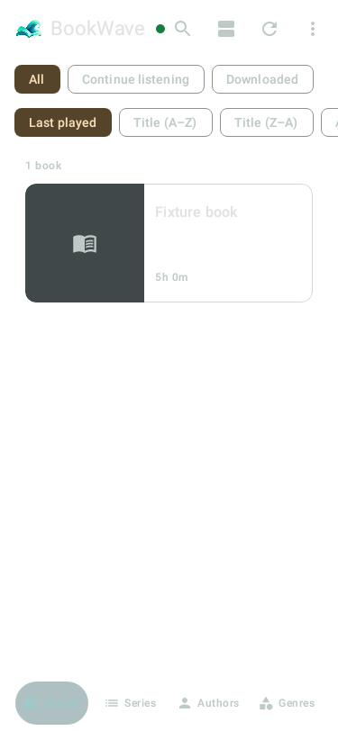
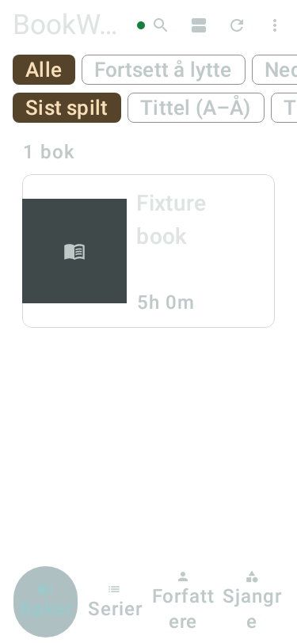

# General book-row metadata clipping — 2026-10-05

Requirements LIB-002/004, spec 2.10/21; partial #192/#194. Base browsecf8db633.
The owner accepts the actual-settings card texture on signed 2193, but reports only the top pixel
of the bottom metadata line. Control 2192 also clips that line; this predates the sampling candidate.

General BookCard now uses 132 dp as a minimum rather than a fixed total height. The text column can
grow for series/progress wrapping and large fonts. The cover stays bounded at 132 dp, so more text
height cannot enlarge the cover and squeeze the remaining text width. No intrinsic measurement is
added. Existing title/author ellipsis policy, details action, optional direct Play, progress wording,
glass treatment and other card families retain their behavior. The broader compact-list/sort redesign
in #192 remains open; this correction does not complete that issue.

Four native-render tests check actual TextLayoutResult height, complete non-ellipsized series/progress
lines and unclipped text/bar bounds inside the card: unstarted, finished and listening at 375 dp/font 1.0,
and listening at 320 dp/font 2.0. Original: 4 FAIL; fixed: 4 PASS; actual production-source reversion: 4 FAIL
specifically for vertical text clipping; restored: 4 PASS in the full strict gate. Formatter and
verifyDebug warnings-as-errors PASS (initial 2m 8s,1,022 tasks); a second full strict gate passes after
correcting edit-helper UTF-8 decoding before publication (3m 16s,1,022 tasks). No classpath change requires forced rerun.
The first harness compilation had an invalid extension import, corrected before the red run.
An edit-helper decoding error was corrected before publication; exact original Unicode strings are retained.
[Numeric/source evidence](evidence/book-row-metadata-2026-10-05.json).

Caller audit: HomeScreen uses BookCard for flat/focused lists; AuthorScreen uses it for standalone
books. Series detail uses SeriesBookCard. BookCoverThumbnail remains bounded at both BookCard and
the series-header caller. No API, schema, dependency, permission, persistence or playback-policy change.

| Required physical case | State |
| --- | --- |
| Verified signed fixed APK, in-place data/settings retention, actual build identity | PASS: APK2195/sourceeedcbd1e; signer/digest/embedded source verified; actual About-screen readback on 2195 NOT RUN |
| Owner normal-font Norwegian last-line readability and appearance | PASS: “Looks good; bottom lines readable” on 2195 |
| Automated200% text, scroll/return, visible series/progress bounds; owner appearance if needed | NOT RUN |
| Home/focused/Author standalone rows, cached offline/artwork fallback, details/Back without Play | Normal Norwegian Home detail/Back and cached offline PASS on 2195; focused/Author standalone/other fallback cases NOT RUN |
| Other width/theme/language configurations and affected performance comparison | NOT RUN; earlier signed 2193/benchmark evidence retains its source scope |

Private owner screenshots remain ignored locally. Owner texture judgement applies only to the
saved-settings static2193 comparison, not the full PERF-06 matrix. The later2195 finding accepts normal-font bottom metadata readability.

## Synthetic combined-source render evidence

Combined runtime eedcbd1e passes all six row/layout/render cases (1m 6s, 235 tasks).
These fixture captures contain no owner catalogue. They show geometry and full duration placement;
Robolectric fallback colors differ from real hardware, so they do not establish glass/contrast quality.
Actual device appearance remains a separate gate. [Numeric evidence](evidence/book-row-combined-render-2026-10-05.json).

## Signed2195 continuation and merge disposition

Packaging run 37316723646 PASSES with `run_checks=false`; sourceeedcbd1e had already passed the local
full strict gate (3m24s,1,022 tasks). The separate checked run 37312350651 ended CANCELLED after the last
logged `:app:verifyDebug` task, without final Gradle success; it is not recorded PASS. Signed2195 has the
same pinned Loopbound bundle as2192/2193, passes identity/digest checks, and retains all eleven counts,
ten non-profile table fingerprints, profiles except normal lastUsedAt and exact settings.
Automated normal Norwegian detail/Back and cached offline checks pass without Play; network settings
are restored. Owner appearance PASS: “Looks good; bottom lines readable”.
Physical 2195 200% text was not run before the owner needed the phone; native large-text geometry passes.
PR #236 is merged under explicit owner authorization with remaining tests carried forward.
[Delivery evidence](evidence/merge-delivery-2026-10-05.json); [merge/watch list](2026-10-05-merge-delivery.md).
