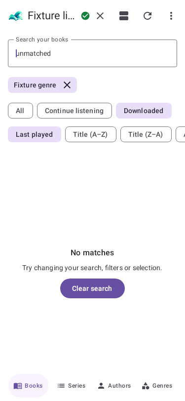
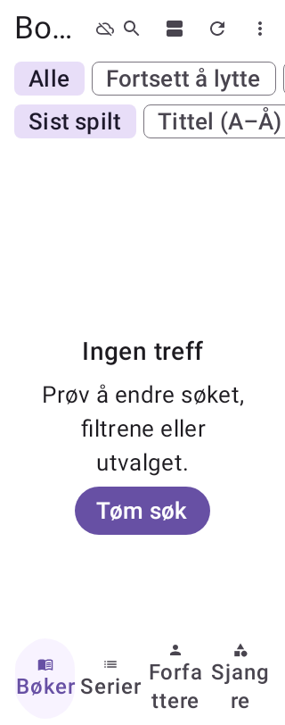

# Home connection status and no-results recovery — 2026-10-05

> **Historical source-scoped evidence.** Reconciled 2026-10-07: the relevant runtime PR is now merged. Original failures, draft build identities and NOT RUN statements below describe their recorded sources/dates. Later scoped results and current obligations are in the [verification register](roadmap-verification-register.md), [merge record](2026-10-05-merge-delivery.md) and [cross-repository audit](../reviews/2026-10-07-cross-repo-reconciliation.md).

**Classification:** Source-scoped delivery evidence and remaining physical-test log.
**Issue:** Partial #195. **Requirements:** LIB-001/002, SET-002, spec 2.10/14.4/17.2/21.
**Branch:** `codex/home-status-recovery-195`; base merged main `df2c80a8`.

## Behavior

The header previously rendered the same 10dp dot for every state and chose green/red using the system
theme even when BookWave selected a different appearance. It now renders a 20dp check-circle for a
reachable server, outlined warning for unreachable, question mark for unknown and crossed-out cloud
for an offline device. Offline still means server status unknown, not server failure. Existing localized
descriptions remain; symbols supply a sighted cue independently of color.

Semantic green/red ink is selected against the active app surface composed over the app ground, with
a 3:1 nominal icon-contrast floor. If neither semantic shade meets that floor, black/white ink supplies
contrast while the shape still identifies the state. Unknown/offline use the active neutral ink when
legible. This numerical guarantee is for the nominal resolved background, not arbitrary moving artwork
or the effective hardware glass composition; those appearance checks remain below.

An empty constrained axis now offers a localized recovery button: Clear search first, then Reset filters,
then Clear selection. Each uses the existing Home action and clears only that constraint. Library,
sort, axis, search visibility and other constraints remain intact. No refresh, new server request,
profile switch or playback request is introduced. A cleared offline search returns to the existing
offline-empty explanation. Unconstrained empty/error/loading/group messages retain their existing policy.

## Verification

Three actual Home/native-render guards fail on original source: missing English/Norwegian recovery
buttons and four connection states rendering one monochrome silhouette. Fixed 3PASS; actual production
HomeScreen reversion3expectedFAIL; exact fixed source restored. Later full verification includes the
same native cases plus three contrast tests. Numeric fixtures cover 104 opaque grayscale/tinted grounds,
all status/offline combinations, offline neutral precedence and translucent app-surface composition.

The first strict run correctly rejects a deprecated HelpOutline icon. The supported AutoMirrored icon
replaces it. Final formatter/strict gate: PASS (1m 49s; 1024 tasks). A test-only Bitmap.getPixel lint finding was corrected to KTX access before this pass. Synthetic light-theme capture now includes an opaque white test backdrop instead of an unreadable transparent PNG. Exact results/source hashes are in the numeric evidence.
No dependency/classpath change is introduced by this slice.

Caller audit: HomeScreen's actual header calls ServerStatusIndicator, which reads the resolved Material
scheme and calls homeStatusTint. AxisContent reaches AxisEmptyState; its recovery delegates to existing
onQueryChanged/onFilterChanged/onFocusCleared, which update only the respective Home controls. No
repository or server-status derivation change, API/schema/migration, permission or playback-owner change.
Existing empty/offline/failed and descriptions are covered by the full Home screen suite.

## Remaining physical cases — NOT RUN

No phone automation is authorized in this session; the owner needs the phone. Automate functional
navigation/state checks when it is offered again; ask only for visual judgement if needed.

| ID | Check needed | Expected / evidence to record |
| --- | --- | --- |
| U-09-01 | Four connection states, normal and grayscale/color-vision display | Distinct, readable symbols and truthful offline/unknown labels; use synthetic reachability fixtures. |
| U-09-02 | BookWave light/dark/AMOLED opposite system theme, dynamic color, background packs and glass tint/blur variations | Symbols remain visible on the effective background; numerical surface tests do not accept artwork/blur contrast. |
| U-09-03 | Recovery buttons at 320/375/414/768dp, English/Norwegian, font1/1.3/2, portrait/landscape and mini-player visible | Labels/buttons readable, reachable and48dp targets without overlap. Native320dp/200% Norwegian and375dp English checks already pass. |
| U-09-04 | Query+filter+selection recovery, all axes, chosen library and cached offline/failed states | Each button clears only its named constraint; library/sort/other controls retained, no unintended refresh; normal empty/offline/error states stay distinct. Automate this functional check. |
| U-09-05 | Playing audio while status changes and recovery actions execute | Same queue/book, uninterrupted heard audio and advancing local progress. UI dispatch tests assert no Play/refresh request; hardware continuity is not inferred. |

Selected owner TalkBack checks from earlier builds remain complete; no new manual TalkBack session is
requested. New localized semantics are tested automatically; wider unperformed speech cases stay open.
This is a bounded implementation of #195 findings 4/7, not closure of its contrast/player/download audit.

## Synthetic native captures

Captures contain disposable fixture content, not the owner's library. They establish drawn shapes,
localized recovery and layout, not real-device glass quality. Status files0/1/2/3 correspond to
reachable/unreachable/unknown/offline. [Numeric/source evidence](evidence/home-status-recovery-2026-10-05.json).

[Reachable](images/2026-10-05-home-recovery/status-0.png),
[Unreachable](images/2026-10-05-home-recovery/status-1.png),
[Unknown](images/2026-10-05-home-recovery/status-2.png),
[Offline](images/2026-10-05-home-recovery/status-3.png).
